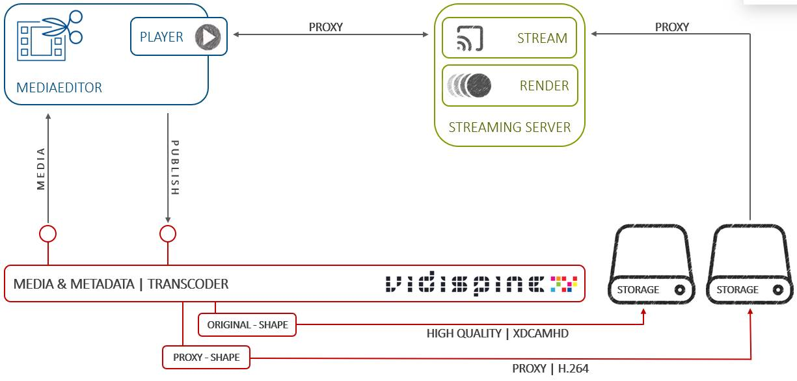

MediaEditor is a browser based proxy editing solution for journalists and video
content producers who need to quickly and easily create short- and medium-form
content. The entry feature set enables easy proxy editing, for example in news,
web, sports or infotainment, with capabilities to render high quality content
that is air-ready for broadcast or as web content. MediaEditor is fully
integrated for use with Vidispine Starter and Team Edition. 

This early version of MediaEditor provides search and preview as well as basic
editing of video assets using “hard cuts”. Publishing timeline as new media on
Vidispine storage and into various video formats is possible using the Vidispine
Transcoding service in Vidinet. Future releases will add more functionality.

VPMS MediaEditor’s Early Version features include:

- Create and manage projects
- Easily search for items (early version just supports video media)
- Import items to timeline and bin
- Preview your content in source and timeline player, incl. full screen mode
- Comfortably edit on your timeline
- Publish sequences and define their metadata in various formats and to different Vidispine storages
- Inteligent project and media locking mechanism
- Intelligent keyboard navigation optimized for editing workflows
